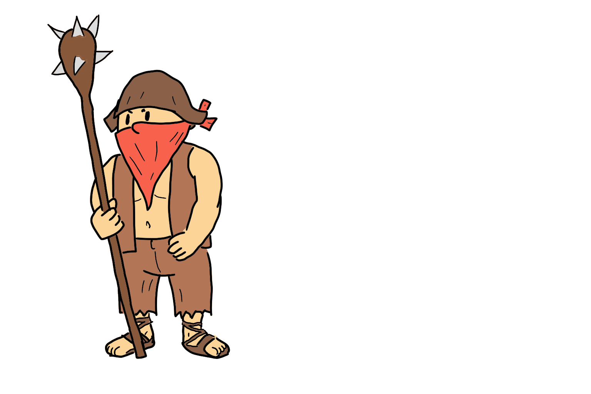
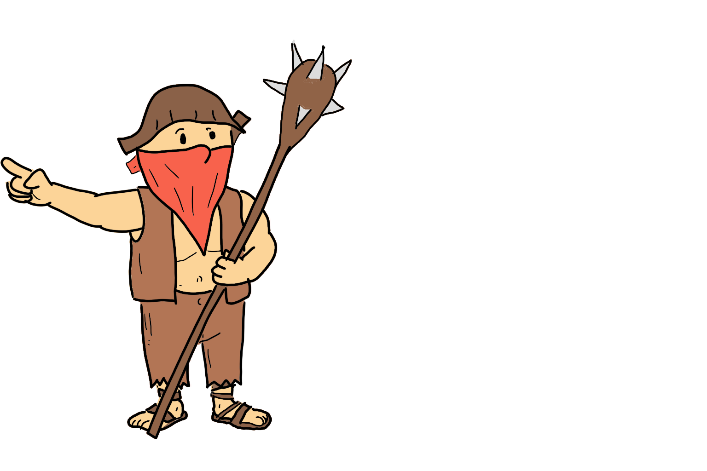

# Preacher

## Beschreibung

Preacher hat immer ein Tuch vor dem Mund. Leitet meistens die Gruppe an, sagt aber nichts und verständigt sich nur durch knappe Zeichen und Gesten. Seine Schweigsamkeit trug ihm den sarkastischen Namen "Preacher" ein.

## Darstellung

|      | links | mitte | rechts |
|-:|:-:|:-:|:-:|
|vorne ||||
|mitte ||||
|hinten||||

## Posen

